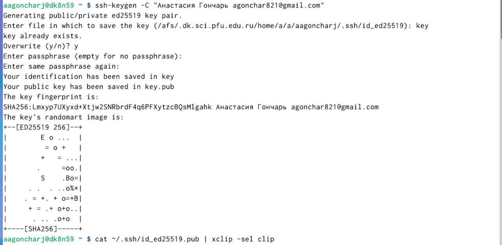
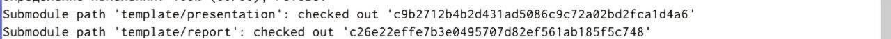

---
## Front matter
title: "Отчет по лабораторной работе №2"
subtitle: "дисциплина: Архитектура компьютера"
author: "Гончарь Анастасия Александровна"

## Generic otions
lang: ru-RU
toc-title: "Содержание"

## Bibliography
bibliography: bib/cite.bib
csl: pandoc/csl/gost-r-7-0-5-2008-numeric.csl

## Pdf output format
toc: true # Table of contents
toc-depth: 2
lof: true # List of figures
lot: true # List of tables
fontsize: 12pt
linestretch: 1.5
papersize: a4
documentclass: scrreprt
## I18n polyglossia
polyglossia-lang:
  name: russian
  options:
	- spelling=modern
	- babelshorthands=true
polyglossia-otherlangs:
  name: english
## I18n babel
babel-lang: russian
babel-otherlangs: english
## Fonts
mainfont: IBM Plex Serif
romanfont: IBM Plex Serif
sansfont: IBM Plex Sans
monofont: IBM Plex Mono
mathfont: STIX Two Math
mainfontoptions: Ligatures=Common,Ligatures=TeX,Scale=0.94
romanfontoptions: Ligatures=Common,Ligatures=TeX,Scale=0.94
sansfontoptions: Ligatures=Common,Ligatures=TeX,Scale=MatchLowercase,Scale=0.94
monofontoptions: Scale=MatchLowercase,Scale=0.94,FakeStretch=0.9
mathfontoptions:
## Biblatex
biblatex: true
biblio-style: "gost-numeric"
biblatexoptions:
  - parentracker=true
  - backend=biber
  - hyperref=auto
  - language=auto
  - autolang=other*
  - citestyle=gost-numeric
## Pandoc-crossref LaTeX customization
figureTitle: "Рис."
tableTitle: "Таблица"
listingTitle: "Листинг"
lofTitle: "Список иллюстраций"
lotTitle: "Список таблиц"
lolTitle: "Листинги"
## Misc options
indent: true
header-includes:
  - \usepackage{indentfirst}
  - \usepackage{float} # keep figures where there are in the text
  - \floatplacement{figure}{H} # keep figures where there are in the text
---

# Цель работы

Целью работы является изучить идеологию и применение средств контроля
версий. Приобрести практические навыки по работе с системой git.

# Задание

1) Настройка github.
2) Базовая настройка git.
3) Создание SSH ключа.
4) Создание рабочего пространства и репозитория курса на основе шаблона.
5) Создание репозитория курса на основе шаблона.
6) Настройка каталога курса.

# Выполнение лабораторной работы

Создаём учетную запись на сайте https://github.com/ (рис. [-@fig:001]).

{ #fig:001 width=70% }

Сначала сделаем предварительную конфигурацию git. Откроем терминал и введем
следующие команды, указав имя и email владельца репозитория и настроим utf-8 в
выводе сообщений git (рис. [-@fig:002]).

{ #fig:002 width=70% }

Зададим имя начальной ветки (назовем её master), параметры autocrlf и safecrlf (рис. [-@fig:004]).

{ #fig:003 width=70% }

Далее необходимо сгенерировать пару ключей (приватный и открытый), загрузить
сохраненный ключ на сайт (рис. [-@fig:004], рис. [-@fig:005]).

{ #fig:004 width=70% }

{ #fig:005 width=70% }

Далее открываем терминал и создаем каталог для предмета «Архитектура
компьютера» (рис. [-@fig:006]).

{ #fig:006 width=70% }

Создаём репозиторий на сайте, а также переходим в каталог курса в терминале (рис. [-@fig:007], рис. [-@fig:008]).

{ #fig:007 width=70% }

{ #fig:008 width=70% }

Клонируем созданный репозиторий (ссылку на клонирование копируем на сайте) (рис. [-@fig:009], рис. [-@fig:010], рис. [-@fig:011]).

{ #fig:009 width=70% }

{ #fig:010 width=70% }
 
{ #fig:011 width=70% } 

Переходим в каталог курса и удаляем лишние файлы (рис. [-@fig:012]).

{ #fig:012 width=70% }

Создаём необходимые каталоги (рис. [-@fig:013]).

{ #fig:013 width=70% }

Отправляем файлы на сервер (рис. [-@fig:014]).

{ #fig:014 width=70% }

Переходим к выполнению заданий для самостоятельной работы.

Создаем отчеты по выполнению лабораторной работы 1 и лабораторной работы 2 в
соответствующих каталогах (рис. [-@fig:015], рис. [-@fig:016]).

{ #fig:015 width=70% }

{ #fig:016 width=70% }

Загружаем файлы на github (рис. [-@fig:017], рис. [-@fig:018]).

{ #fig:017 width=70% }

{ #fig:018 width=70% }

Проверяем правильность создания иерархии рабочего пространства в локальном
репозитории на странице github (рис. [-@fig:019], рис. [-@fig:020], рис. [-@fig:021]).

{ #fig:019 width=70% }

{ #fig:020 width=70% }
 
{ #fig:021 width=70% } 

# Выводы

Выполнив лабораторную работу, я изучила идеологию и применение средств
контроля версийа также приобрела практические навыки по работе с
системой git.

# Список литературы{.unnumbered}

::: {#refs}
:::
