---
## Front matter
title: "Отчет по Лабораторной работе №4"
subtitle: "дисциплина: Архитектура компьютера"
author: "Гончарь Анастасия Александровна"

## Generic otions
lang: ru-RU
toc-title: "Содержание"

## Bibliography
bibliography: bib/cite.bib
csl: pandoc/csl/gost-r-7-0-5-2008-numeric.csl

## Pdf output format
toc: true # Table of contents
toc-depth: 2
lof: true # List of figures
lot: true # List of tables
fontsize: 12pt
linestretch: 1.5
papersize: a4
documentclass: scrreprt
## I18n polyglossia
polyglossia-lang:
  name: russian
  options:
	- spelling=modern
	- babelshorthands=true
polyglossia-otherlangs:
  name: english
## I18n babel
babel-lang: russian
babel-otherlangs: english
## Fonts
mainfont: IBM Plex Serif
romanfont: IBM Plex Serif
sansfont: IBM Plex Sans
monofont: IBM Plex Mono
mathfont: STIX Two Math
mainfontoptions: Ligatures=Common,Ligatures=TeX,Scale=0.94
romanfontoptions: Ligatures=Common,Ligatures=TeX,Scale=0.94
sansfontoptions: Ligatures=Common,Ligatures=TeX,Scale=MatchLowercase,Scale=0.94
monofontoptions: Scale=MatchLowercase,Scale=0.94,FakeStretch=0.9
mathfontoptions:
## Biblatex
biblatex: true
biblio-style: "gost-numeric"
biblatexoptions:
  - parentracker=true
  - backend=biber
  - hyperref=auto
  - language=auto
  - autolang=other*
  - citestyle=gost-numeric
## Pandoc-crossref LaTeX customization
figureTitle: "Рис."
tableTitle: "Таблица"
listingTitle: "Листинг"
lofTitle: "Список иллюстраций"
lotTitle: "Список таблиц"
lolTitle: "Листинги"
## Misc options
indent: true
header-includes:
  - \usepackage{indentfirst}
  - \usepackage{float} # keep figures where there are in the text
  - \floatplacement{figure}{H} # keep figures where there are in the text
---

# Цель работы

Целью работы является освоение процедуры компиляции и сборки программ, написанных на ассемблере NASM.

# Задание

1.Создание программы Hello world!
2.Работа с транслятором NASM
3.Работа с расширенным синтаксисом командной строки NASM
4.Работа с компоновщиком LD
5.Запуск исполняемого файла
6.Выполнение задания для самостоятельной работы

# Выполнение лабораторной работы

## Создание программы Hello world!

Создаем каталог для работы с программами на языке ассемблера NASM (рис. [-@fig:001]).

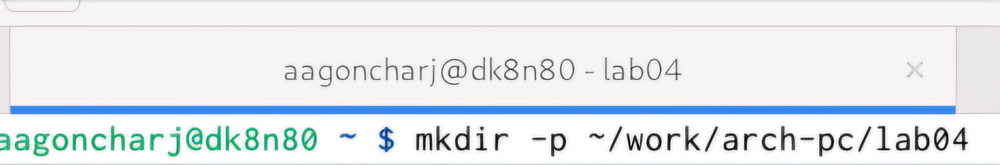{#fig:001 width=70%}

Далее переходим в созданный каталог и создаем в нем текстовый файл hello.asm (рис. [-@fig:002]).

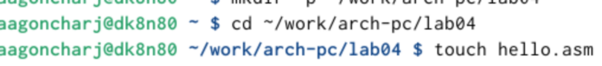{#fig:002 width=70%}

Теперь открываем созданный файл с помощью текстового редактора gedit и вводим в него необходимый текст (рис. [-@fig:003]).

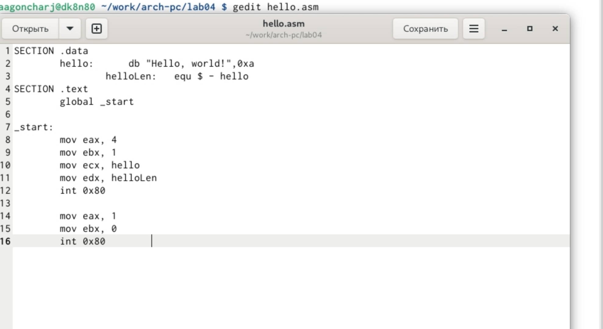{#fig:003 width=70%}

## Работа с транслятором NASM

Проводим компиляцию текста программы  «Hello World», вставленного в файл hello.asm (рис. [-@fig:004]).

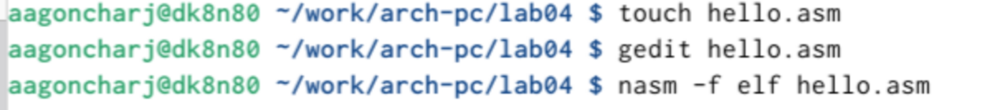{#fig:004 width=70%}

## Работа с расширенным синтаксисом командной строки NASM

Теперь нужно скомпилировать исходный файл hello.asm в obj.o (рис. [-@fig:005]).

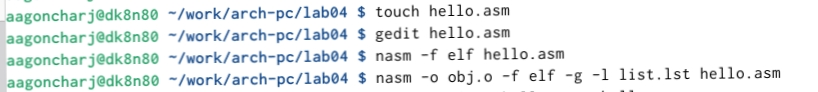{#fig:005 width=70%}

## Работа с компоновщиком LD

Чтобы получить исполняемую программу, объектный файл передаем на обработку компоновщику, и помощью команды ls проверяем, что исполняемый файл hello был создан (рис. [-@fig:006]).

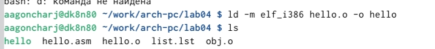{#fig:006 width=70%}

Делее выполняем следующую команду: ld -m elf_i386 obj.o -o main (рис. [-@fig:007]).

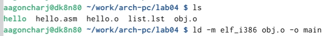{#fig:007 width=70%}

## Запуск исполняемого файла

Запускаем на выполнение созданный исполняемый файл, находящийся в текущем каталоге (рис. [-@fig:008]).

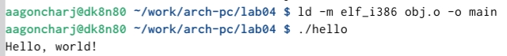{#fig:008 width=70%}

## Выполнение задания для самостоятельной работы

В каталоге ~/work/arch-pc/lab04 с помощью команды cp создаем копию файла
hello.asm с именем lab4.asm (рис. [-@fig:009]).

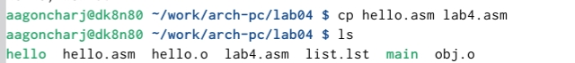{#fig:009 width=70%}

С помощью текстового редактора gedit вносим изменения в текст программы в
файле lab4.asm так, чтобы вместо Hello world! на экран выводилась строка с моей
именем и фамилией (рис. [-@fig:010]).

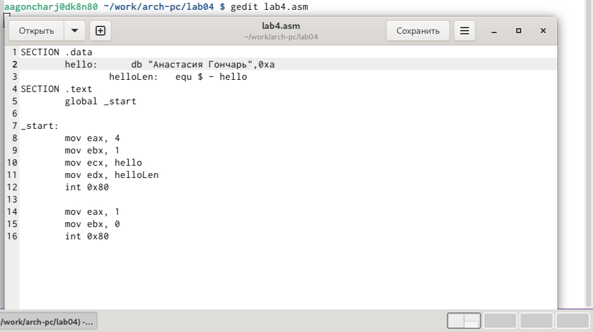{#fig:010 width=70%}

Оттранслируем полученный текст программы lab4.asm в объектный файл. Выполним
компоновку объектного файла и запустим получившийся исполняемый файл (рис. [-@fig:011]).

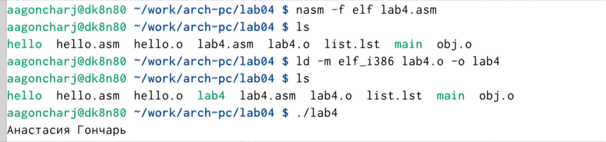{#fig:011 width=70%}

Теперь скопируем файлы hello.asm и lab4.asm в каталог ~/work/study/2024-2025/"Архитектура компьютера"/arch-pc/labs/lab04/ (рис. [-@fig:012]).

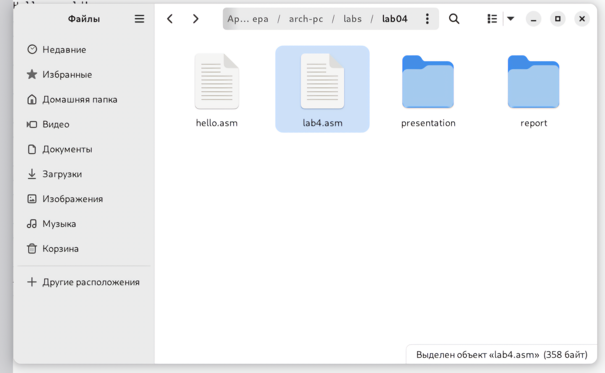{#fig:012 width=70%}

Загружаем файлы на Github (рис. [-@fig:013]).
 
 {#fig:013 width=70%}

# Выводы

При выполнении данной лабораторной работы я освоила процедуры компиляции и сборки программ, написанных на ассемблере NASM.

