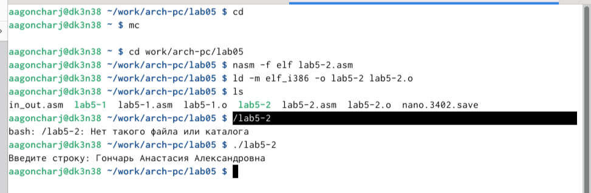
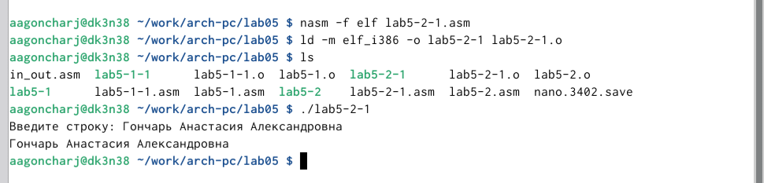

---
## Front matter
title: "Отчёт по Лабораторной работе №5"
subtitle: "дисциплина: Архитектура компьютера"
author: "Гончарь Анастасия Александровна"

## Generic otions
lang: ru-RU
toc-title: "Содержание"

## Bibliography
bibliography: bib/cite.bib
csl: pandoc/csl/gost-r-7-0-5-2008-numeric.csl

## Pdf output format
toc: true # Table of contents
toc-depth: 2
lof: true # List of figures
lot: true # List of tables
fontsize: 12pt
linestretch: 1.5
papersize: a4
documentclass: scrreprt
## I18n polyglossia
polyglossia-lang:
  name: russian
  options:
	- spelling=modern
	- babelshorthands=true
polyglossia-otherlangs:
  name: english
## I18n babel
babel-lang: russian
babel-otherlangs: english
## Fonts
mainfont: IBM Plex Serif
romanfont: IBM Plex Serif
sansfont: IBM Plex Sans
monofont: IBM Plex Mono
mathfont: STIX Two Math
mainfontoptions: Ligatures=Common,Ligatures=TeX,Scale=0.94
romanfontoptions: Ligatures=Common,Ligatures=TeX,Scale=0.94
sansfontoptions: Ligatures=Common,Ligatures=TeX,Scale=MatchLowercase,Scale=0.94
monofontoptions: Scale=MatchLowercase,Scale=0.94,FakeStretch=0.9
mathfontoptions:
## Biblatex
biblatex: true
biblio-style: "gost-numeric"
biblatexoptions:
  - parentracker=true
  - backend=biber
  - hyperref=auto
  - language=auto
  - autolang=other*
  - citestyle=gost-numeric
## Pandoc-crossref LaTeX customization
figureTitle: "Рис."
tableTitle: "Таблица"
listingTitle: "Листинг"
lofTitle: "Список иллюстраций"
lotTitle: "Список таблиц"
lolTitle: "Листинги"
## Misc options
indent: true
header-includes:
  - \usepackage{indentfirst}
  - \usepackage{float} # keep figures where there are in the text
  - \floatplacement{figure}{H} # keep figures where there are in the text
---

# Цель работы

Целью данной лабораторной работы является приобретение практических навыков работы в Midnight Commander, освоение инструкций языка ассемблера mov и int.

# Задание

1.Основы работы с mc
2.Подключение внешнего файла in_out.asm
3.Выполнение заданий для самостоятельной работы

# Теоретическое введение

Здесь описываются теоретические аспекты, связанные с выполнением работы.

Например, в табл. [-@tbl:std-dir] приведено краткое описание стандартных каталогов Unix.

: Описание некоторых каталогов файловой системы GNU Linux {#tbl:std-dir}

| Имя каталога | Описание каталога                                                                                                          |
|--------------|----------------------------------------------------------------------------------------------------------------------------|
| `/`          | Корневая директория, содержащая всю файловую                                                                               |
| `/bin `      | Основные системные утилиты, необходимые как в однопользовательском режиме, так и при обычной работе всем пользователям     |
| `/etc`       | Общесистемные конфигурационные файлы и файлы конфигурации установленных программ                                           |
| `/home`      | Содержит домашние директории пользователей, которые, в свою очередь, содержат персональные настройки и данные пользователя |
| `/media`     | Точки монтирования для сменных носителей                                                                                   |
| `/root`      | Домашняя директория пользователя  `root`                                                                                   |
| `/tmp`       | Временные файлы                                                                                                            |
| `/usr`       | Вторичная иерархия для данных пользователя                                                                                 |

Более подробно про Unix см. в [@tanenbaum_book_modern-os_ru; @robbins_book_bash_en; @zarrelli_book_mastering-bash_en; @newham_book_learning-bash_en].

# Выполнение лабораторной работы

## Основы работы с mc

Сначала откроем Midnight Commander, введя в терминал mc (рис. [-@fig:001]).

{ #fig:001 width=70% }

Переходим в каталог ~/work/arch-pc (рис. [-@fig:002])

{ #fig:002 width=70% }

С помощью функциональной клавиши F7 создаем каталог lab05 (рис. [-@fig:003]).

{ #fig:003 width=70% }

Переходим в созданный каталог (рис. [-@fig:004]).

{ #fig:004 width=70% }

Пользуясь строкой ввода и командой touch lab5-1.asm, создаю файл lab5-1.asm (рис. [-@fig:005]).

{ #fig:005 width=70% }

С помощью функциональной клавиши F4 открываю созданный файл для редактирования в редакторе mcedit (рис. [-@fig:006]).

{ #fig:006 width=70% }

Ввожу в файл код программы вывода сообщения на экран и ввода строки с клавиатуры (рис. [-@fig:007]). Далее выхожу из файла, сохраняя изменения.

{ #fig:007 width=70% }

С помощью функциональной клавиши F3 открываю файл lab5-1.asm для просмотра (рис. [-@fig:008]).

{ #fig:008 width=70% }

Теперь необходимо оттранслировать текст программы в объектный файл и выполнить компоновку объектного файла с помощью команд nasm -f elf lab5-1.asm, ld -m elf_i386 -o lab5-1 lab5-1.o, ./lab5-1 (рис. [-@fig:009]).

{ #fig:009 width=70% }

После запуска программы я ввожу свои ФИО (рис. [-@fig:010]).

{ #fig:010 width=70% }

## Подключение внешнего файла in_out.asm

Скачиваю файл in_out.asm со страницы курса в ТУИС, который сохранится в каталог "Загрузки". (рис. [-@fig:011]).

{ #fig:011 width=70% }

Копирую файл in_out.asm из каталога "Загрузки" в созданный каталог lab05 (рис. [-@fig:012]).

{ #fig:012 width=70% }

С помощью функциональной клавиши F5 копирую файл lab5-1 в тот же каталог, но с другим именем (рис. [-@fig:013]).

{ #fig:013 width=70% }

Изменяю содержимое файла lab5-2.asm во встроенном редакторе, чтобы в программе использовались подпрограммы из внешнего файла in_out.asm (рис. [-@fig:014]).

{ #fig:014 width=70% }

Также изменяю в нем подпрограмму sprintLF на sprint. Сохраняю изменения и открываю файл для просмотра, чтобы проверить сохранение действий (рис. [-@fig:015]).

{ #fig:015 width=70% }

Транслирую файл, выполняю компоновку созданного объектного файла и запускаю новый исполняемый файл (рис. [-@fig:016]).

{ #fig:016 width=70% }

## Выполнение заданий для самостоятельной работы

Создаю копию файла lab5-1.asm с именем lab5-1-1.asm с помощью функциональной клавиши F5 (рис. [-@fig:017]).

{ #fig:017 width=70% }

С помощью функциональной клавиши F4 открываю созданный файл для редактирования и изменяю программу так, чтобы кроме вывода приглашения и запроса ввода, она выводила вводимую пользователем строку (рис. [-@fig:018]). 

{ #fig:018 width=70% }

Код программы для файла lab5-1-1.asm:

```NASM
SECTION .data ; Секция инициированных данных
msg: DB 'Введите строку:',10
msgLen: EQU $-msg ; Длина переменной 'msg'
SECTION .bss ; Секция не инициированных данных
buf1: RESB 80 ; Буфер размером 80 байт
SECTION .text ; Код программы
GLOBAL _start ; Начало программы
_start: ; Точка входа в программу
mov eax,4 ; Системный вызов для записи (sys_write)
mov ebx,1 ; Описатель файла 1 - стандартный вывод
mov ecx,msg ; Адрес строки 'msg' в 'ecx'
mov edx,msgLen ; Размер строки 'msg' в 'edx'
int 80h ; Вызов ядра
mov eax, 3 ; Системный вызов для чтения (sys_read)
mov ebx, 0 ; Дескриптор файла 0 - стандартный ввод
mov ecx, buf1 ; Адрес буфера под вводимую строку
mov edx, 80 ; Длина вводимой строки
int 80h ; Вызов ядра
mov eax,4 ; Системный вызов для записи (sys_write)
mov ebx,1 ; Описатель файла '1' - стандартный вывод
mov ecx,buf1 ; Адрес строки buf1 в ecx
mov edx,buf1 ; Размер строки buf1
int 80h ; Вызов ядра
mov eax,1 ; Системный вызов для выхода (sys_exit)
mov ebx,0 ; Выход с кодом возврата 0 (без ошибок)
int 80h ; Вызов ядра
```

Транслирую файл, выполняю компоновку созданного объектного файла и запускаю новый исполняемый файл. Далее ввожу свои ФИО и программа выводит введенные мною данные (рис. [-@fig:019]).
 
{ #fig:019 width=70% }

Создаю копию файла lab5-2.asm с именем lab5-2-1.asm с помощью функциональной клавиши F5 (рис. [-@fig:020]).

{ #fig:020 width=70% }

С помощью функциональной клавиши F4 открываю созданный файл для редактирования. Изменяю программу так, чтобы кроме вывода приглашения и запроса ввода, она выводила вводимую пользователем строку (рис. [-@fig:021]). 

{ #fig:021 width=70% }

Код программы для файла lab5-2-1.asm:

```NASM
%include 'in_out.asm'
SECTION .data ; Секция инициированных данных
msg: DB 'Введите строку: ',0h ; сообщение
SECTION .bss ; Секция не инициированных данных
buf1: RESB 80 ; Буфер размером 80 байт
SECTION .text ; Код программы
GLOBAL _start ; Начало программы
_start: ; Точка входа в программу
mov eax, msg ; запись адреса выводимого сообщения в `EAX`
call sprint ; вызов подпрограммы печати сообщения
mov ecx, buf1 ; запись адреса переменной в `EAX`
mov edx, 80 ; запись длины вводимого сообщения в `EBX`
call sread ; вызов подпрограммы ввода сообщения
mov eax,4 ; Системный вызов для записи (sys_write)
mov ebx,1 ; Описатель файла '1' - стандартный вывод
mov ecx,buf1 ; Адрес строки buf1 в ecx
int 80h ; Вызов ядра
call quit ; вызов подпрограммы завершения
```

Транслирую файл, выполняю компоновку созданного объектного файла и запускаю новый исполняемый файл. Далее ввожу свои ФИО, при этом программа запрашивает ввод без переноса на новую строку, и программа выводит введенные мною данные (рис. [-@fig:023]).

{ #fig:023 width=70% }

# Выводы

При выполнении данной лабораторной работы я приобрела практические навыки работы в Midnight Commander, а также освоила инструкции языка ассемблера mov и int.

# Список литературы{.unnumbered}

::: {#refs}
:::
