---
## Front matter
title: "Отчет по лабораторной работе №6"
subtitle: "Дисциплина: архитектура компьютера"
author: "Гончарь Анастасия Александровна"

## Generic otions
lang: ru-RU
toc-title: "Содержание"

## Bibliography
bibliography: bib/cite.bib
csl: pandoc/csl/gost-r-7-0-5-2008-numeric.csl

## Pdf output format
toc: true # Table of contents
toc-depth: 2
lof: true # List of figures
lot: true # List of tables
fontsize: 12pt
linestretch: 1.5
papersize: a4
documentclass: scrreprt
## I18n polyglossia
polyglossia-lang:
  name: russian
  options:
	- spelling=modern
	- babelshorthands=true
polyglossia-otherlangs:
  name: english
## I18n babel
babel-lang: russian
babel-otherlangs: english
## Fonts
mainfont: IBM Plex Serif
romanfont: IBM Plex Serif
sansfont: IBM Plex Sans
monofont: IBM Plex Mono
mathfont: STIX Two Math
mainfontoptions: Ligatures=Common,Ligatures=TeX,Scale=0.94
romanfontoptions: Ligatures=Common,Ligatures=TeX,Scale=0.94
sansfontoptions: Ligatures=Common,Ligatures=TeX,Scale=MatchLowercase,Scale=0.94
monofontoptions: Scale=MatchLowercase,Scale=0.94,FakeStretch=0.9
mathfontoptions:
## Biblatex
biblatex: true
biblio-style: "gost-numeric"
biblatexoptions:
  - parentracker=true
  - backend=biber
  - hyperref=auto
  - language=auto
  - autolang=other*
  - citestyle=gost-numeric
## Pandoc-crossref LaTeX customization
figureTitle: "Рис."
tableTitle: "Таблица"
listingTitle: "Листинг"
lofTitle: "Список иллюстраций"
lotTitle: "Список таблиц"
lolTitle: "Листинги"
## Misc options
indent: true
header-includes:
  - \usepackage{indentfirst}
  - \usepackage{float} # keep figures where there are in the text
  - \floatplacement{figure}{H} # keep figures where there are in the text
---

# Цель работы

Целью данной лабораторной работы является освоение арифметческих инструкций языка ассемблера NASM.

# Задание

1. Символьные и численные данные в NASM
2. Выполнение арифметических операций в NASM
3. Выполнение заданий для самостоятельной работы

# Теоретическое введение

Здесь описываются теоретические аспекты, связанные с выполнением работы.

Например, в табл. [-@tbl:std-dir] приведено краткое описание стандартных каталогов Unix.

: Описание некоторых каталогов файловой системы GNU Linux {#tbl:std-dir}

| Имя каталога | Описание каталога                                                                                                          |
|--------------|----------------------------------------------------------------------------------------------------------------------------|
| `/`          | Корневая директория, содержащая всю файловую                                                                               |
| `/bin `      | Основные системные утилиты, необходимые как в однопользовательском режиме, так и при обычной работе всем пользователям     |
| `/etc`       | Общесистемные конфигурационные файлы и файлы конфигурации установленных программ                                           |
| `/home`      | Содержит домашние директории пользователей, которые, в свою очередь, содержат персональные настройки и данные пользователя |
| `/media`     | Точки монтирования для сменных носителей                                                                                   |
| `/root`      | Домашняя директория пользователя  `root`                                                                                   |
| `/tmp`       | Временные файлы                                                                                                            |
| `/usr`       | Вторичная иерархия для данных пользователя                                                                                 |

Более подробно про Unix см. в [@tanenbaum_book_modern-os_ru; @robbins_book_bash_en; @zarrelli_book_mastering-bash_en; @newham_book_learning-bash_en].

# Выполнение лабораторной работы

## Символьные и численные данные в NASM

Сначала с помощью mkdir создаю директорию, в которой буду создавать файлы с программами (рис. [-@fig:001]). Перехожу в созданный каталог с помощью утилиты cd.

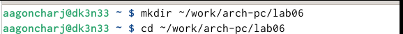{ #fig:001 width=70% }

С помощью touch создаю файл lab6-1.asm (рис. [-@fig:002]).

{ #fig:002 width=70% }

Копирую в текущий каталог файл in_out.asm, т.к. он будет использоваться в других программах (рис. [-@fig:003]).

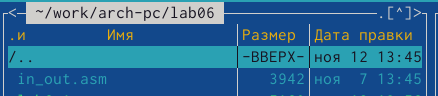{ #fig:003 width=70% }

Открываю созданный файл lab6-1.asm и вставляю в него программу вывода значения регистра eax (рис. [-@fig:004]).

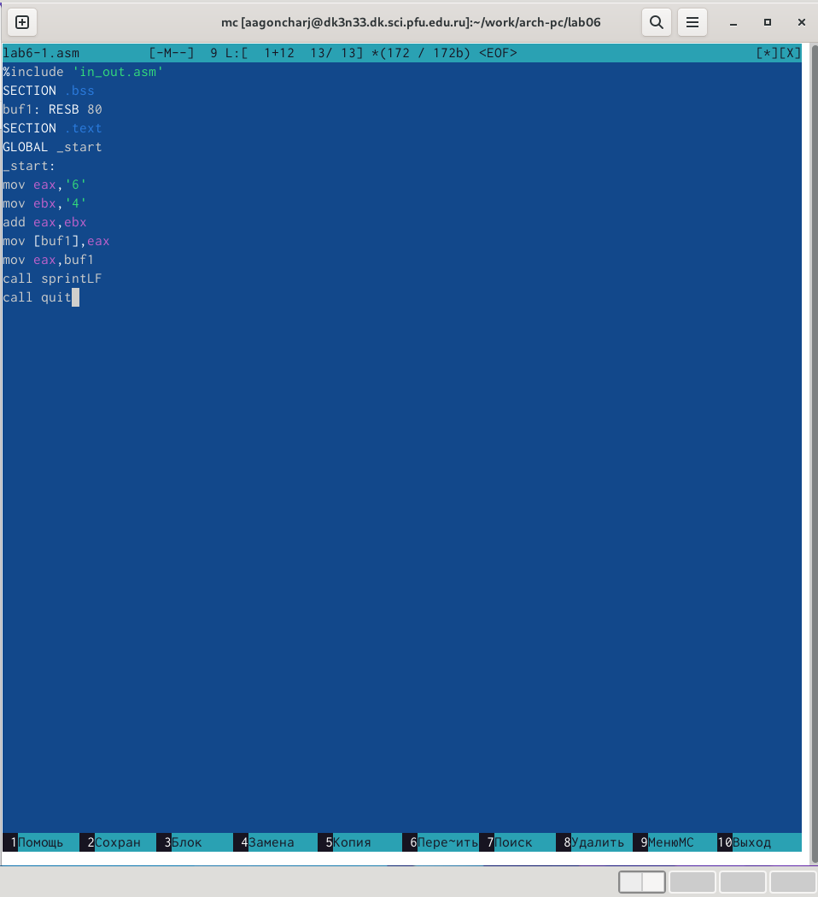{ #fig:004 width=70% }

Создаю исполняемый файл программы и запускаю его. Вывод программы - символ j, потому что программа вывела символ, соответствующий по системе ASCII сумме двоичных кодов символов 4 и 6. (рис. [-@fig:005])

{ #fig:005 width=70% }

Изменяю в тексте программы символы "6" и "4" на цифры 6 и 4 (рис. [-@fig:006]). 

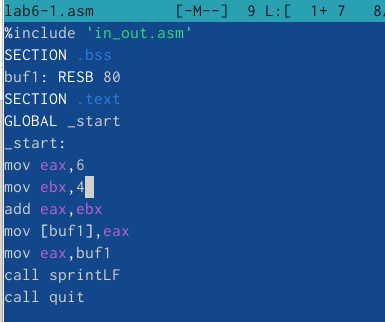{ #fig:006 width=70% }

Создаю новый исполняемый файл программы и запускаю его. (рис. [-@fig:007])

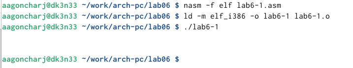{ #fig:007 width=70% }

Создаю новый файл lab6-2.asm с помощью touch (рис. [-@fig:008]).

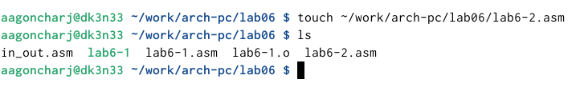{ #fig:008 width=70% }

Ввожу в файл другой текст программы для вывода значения регистра eax (рис. [-@fig:009]).

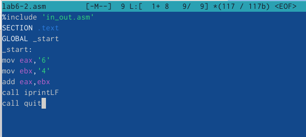{ #fig:009 width=70% }

Создаю и запускаю исполняемый файл lab6-2 (рис. [-@fig:010]). Теперь выводится число 106.

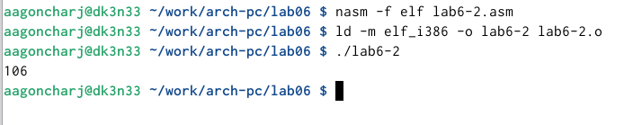{ #fig:010 width=70% }

Заменяю в тексте программы в файле lab6-2.asm символы "6" и "4" на числа 6 и 4 (рис. [-@fig:011]).

{ #fig:011 width=70% }

Создаю и запускаю новый исполняемый файл. Теперь выводится 10,так как программа складывает не соответствующие символам коды в системе ASCII, а сами числа.(рис. [-@fig:012])

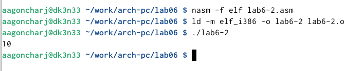{ #fig:012 width=70% }

Заменяю в тексте программы функцию iprintLF на iprint (рис. [-@fig:013]).

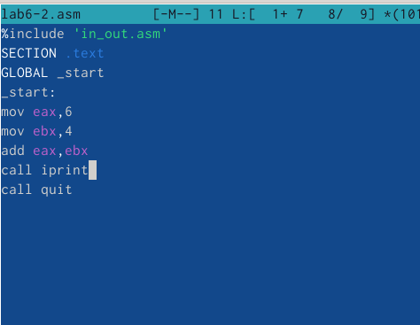{ #fig:013 width=70% }

Создаю и запускаю новый исполняемый файл. Вывод не изменился, потому что символ переноса строки не отображался, когда программа исполнялась с функцией iprintLF, а iprint не добавляет к выводу символ переноса строки, в отличие от iprintLF. (рис. [-@fig:014])

{ #fig:014 width=70% }

## Выполнение арифметических операций в NASM

Создаю файл lab7-3.asm с помощью утилиты touch (рис. [-@fig:015]).

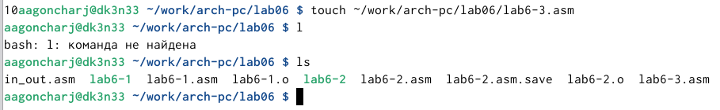{ #fig:015 width=70% }

Ввожу в созданный файл текст программы для вычисления значения выражения f(x) = (5 * 2 + 3)/3 (рис. [-@fig:016]).

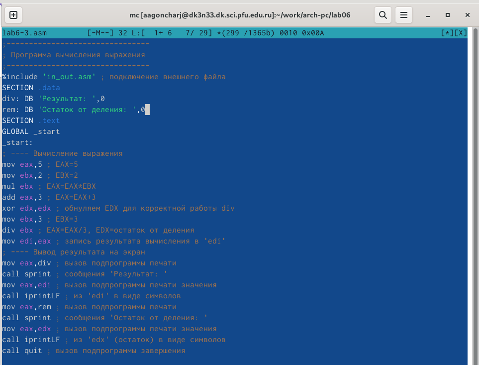{ #fig:016 width=70% }

Создаю исполняемый файл и запускаю его. (рис. [-@fig:017])

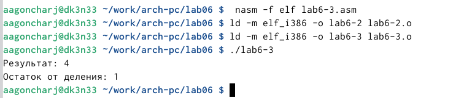{ #fig:017 width=70% }

Изменяю программу так, чтобы она вычисляла значение выражения f(x) = (4 * 6 + 2)/5 (рис. [-@fig:018]). 

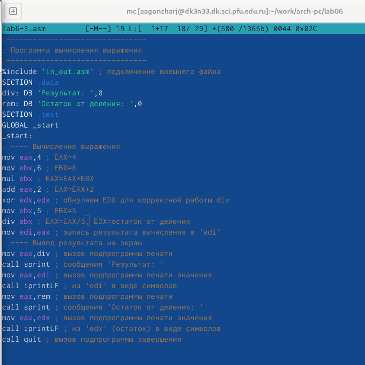{ #fig:018 width=70% }

Создаю и запускаю новый исполняемый файл (рис. [-@fig:019]).

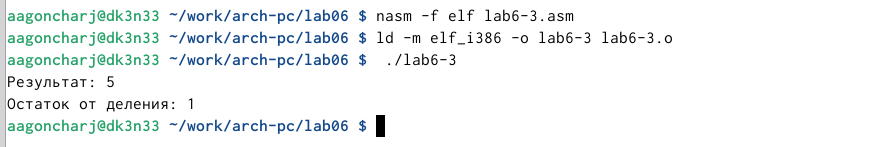{ #fig:019 width=70% }

Создаю файл variant.asm с помощью touch (рис. [-@fig:020]).

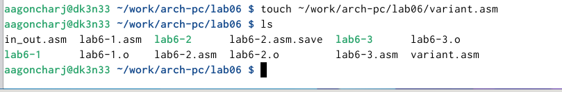{ #fig:020 width=70% }

Ввожу в файл текст программы для вычисления варианта задания по номеру студенческого билета (рис. [-@fig:021]).

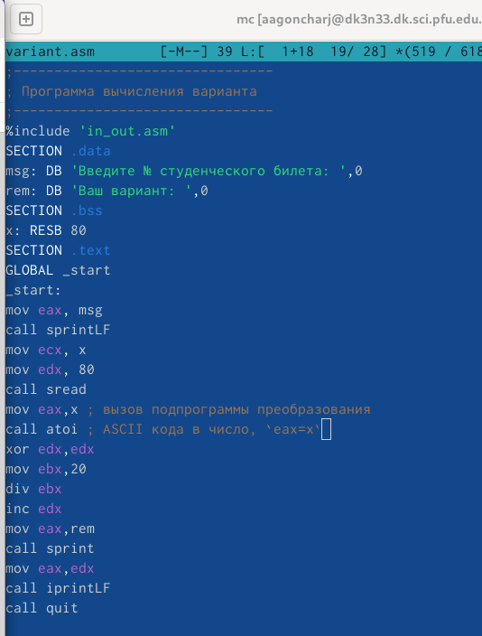{ #fig:021 width=70% }

Создаю и запускаю исполняемый файл. Ввожу номер своего студ. билета с клавиатуры, программа вывела, что мой вариант - 15. (рис. [-@fig:022])

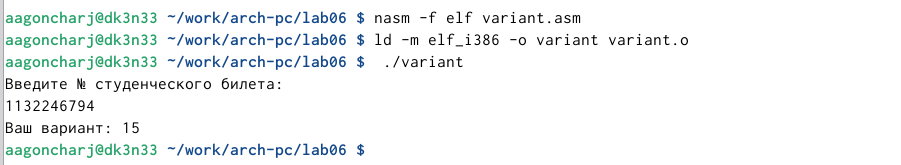{ #fig:022 width=70% }

### Ответы на вопросы по программе

1. За вывод сообщения "Ваш вариант" отвечают строки кода:

```NASM
mov eax,rem
call sprint
```
2. Инструкция mov ecx, x используется, чтобы положить адрес вводимой строки x в регистр ecx
mov edx, 80 - запись в регистр edx длины вводимой строки 
call sread - вызов подпрограммы из внешнего файла, обеспечивающей ввод сообщения с клавиатуры.

3. call atoi используется для вызова подпрограммы из внешнего файла, которая преобразует ascii-код символа в целое число и записывает результат в регистр eax.

4. За вычисления варианта отвечают строки:

```NASM
xor edx,edx ; обнуление edx для корректной работы div
mov ebx,20 ; ebx = 20
div ebx ; eax = eax/20, edx - остаток от деления
inc edx ; edx = edx + 1
```

5. При выполнении инструкции div ebx остаток от деления записывается в регистр edx.

6. Инструкция inc edx увеличивает значение регистра edx на 1.

7. За вывод на экран результатов вычислений отвечают строки:

```NASM
mov eax,edx
call iprintLF
```

## Выполнение заданий для самостоятельной работы

Создаю файл lab6-4.asm с помощью touch (рис. [-@fig:023]).

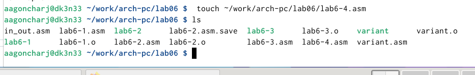{ #fig:023 width=70% }

Открываю созданный файл для редактирования, ввожу в него текст программы для вычисления значения выражения (x+5)^2-3 из варианта 15 (рис. [-@fig:024]).

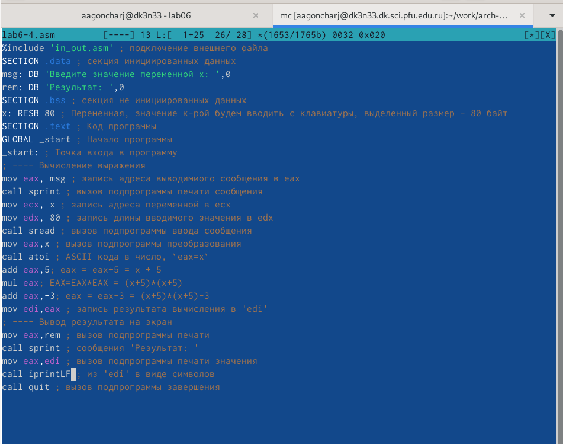{ #fig:024 width=70% }

Создаю и запускаю исполняемый файл. При вводе значения 1 выводится число 33, при вводе значения 5 - 97, что явлется верным. (рис. [-@fig:025])

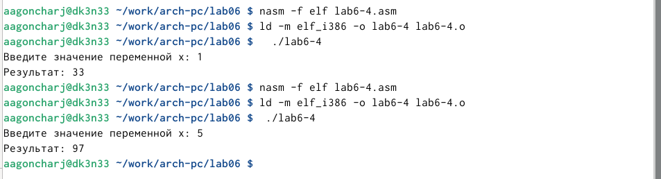{ #fig:025 width=70% }

### Листинг программы для вычисления значения выражения (x+5)^2-3 

```NASM
%include 'in_out.asm' ; подключение внешнего файла
SECTION .data ; секция инициированных данных
msg: DB 'Введите значение переменной х: ',0
rem: DB 'Результат: ',0
SECTION .bss ; секция не инициированных данных
x: RESB 80 ; Переменная, значение к-рой будем вводить с клавиатуры, выделенный >
SECTION .text ; Код программы
GLOBAL _start ; Начало программы
_start: ; Точка входа в программу
; ---- Вычисление выражения
mov eax, msg ; запись адреса выводимиого сообщения в eax
call sprint ; вызов подпрограммы печати сообщения
mov ecx, x ; запись адреса переменной в ecx
mov edx, 80 ; запись длины вводимого значения в edx
call sread ; вызов подпрограммы ввода сообщения
mov eax,x ; вызов подпрограммы преобразования
call atoi ; ASCII кода в число, `eax=x`
add eax,5; eax = eax+5 = x + 5
mul eax; EAX=EAX*EAX = (x+5)*(x+5)
add eax,-3; eax = eax-3 = (x+5)*(x+5)-3
mov edi,eax ; запись результата вычисления в 'edi'
; ---- Вывод результата на экран
mov eax,rem ; вызов подпрограммы печати
call sprint ; сообщения 'Результат: '
mov eax,edi ; вызов подпрограммы печати значения
call iprintLF ; из 'edi' в виде символов
call quit ; вызов подпрограммы завершения

```

# Выводы

При выполнении данной лабораторной работы я освоила арифметические инструкции языка ассемблера NASM.

# Список литературы{.unnumbered}

::: {#refs}
:::
