---
## Front matter
title: "Отчет по лабораторной работе №7"
subtitle: "Дисциплина: архитектура компьютера"
author: "Гончарь Анастасия Александровна"

## Generic otions
lang: ru-RU
toc-title: "Содержание"

## Bibliography
bibliography: bib/cite.bib
csl: pandoc/csl/gost-r-7-0-5-2008-numeric.csl

## Pdf output format
toc: true # Table of contents
toc-depth: 2
lof: true # List of figures
lot: true # List of tables
fontsize: 12pt
linestretch: 1.5
papersize: a4
documentclass: scrreprt
## I18n polyglossia
polyglossia-lang:
  name: russian
  options:
	- spelling=modern
	- babelshorthands=true
polyglossia-otherlangs:
  name: english
## I18n babel
babel-lang: russian
babel-otherlangs: english
## Fonts
mainfont: IBM Plex Serif
romanfont: IBM Plex Serif
sansfont: IBM Plex Sans
monofont: IBM Plex Mono
mathfont: STIX Two Math
mainfontoptions: Ligatures=Common,Ligatures=TeX,Scale=0.94
romanfontoptions: Ligatures=Common,Ligatures=TeX,Scale=0.94
sansfontoptions: Ligatures=Common,Ligatures=TeX,Scale=MatchLowercase,Scale=0.94
monofontoptions: Scale=MatchLowercase,Scale=0.94,FakeStretch=0.9
mathfontoptions:
## Biblatex
biblatex: true
biblio-style: "gost-numeric"
biblatexoptions:
  - parentracker=true
  - backend=biber
  - hyperref=auto
  - language=auto
  - autolang=other*
  - citestyle=gost-numeric
## Pandoc-crossref LaTeX customization
figureTitle: "Рис."
tableTitle: "Таблица"
listingTitle: "Листинг"
lofTitle: "Список иллюстраций"
lotTitle: "Список таблиц"
lolTitle: "Листинги"
## Misc options
indent: true
header-includes:
  - \usepackage{indentfirst}
  - \usepackage{float} # keep figures where there are in the text
  - \floatplacement{figure}{H} # keep figures where there are in the text
---

# Цель работы

Целью данной лабораторной работы является изучение команд условного и безусловного переходов, приобретение навыков написания программ с использованием переходов и знакомство с назначением и структурой файла листинга.

# Задание

1.Реализация переходов в NASM
2.Изучение структуры файлы листинга
3.Задание для самостоятельной работы


# Теоретическое введение

Здесь описываются теоретические аспекты, связанные с выполнением работы.

Например, в табл. [-@tbl:std-dir] приведено краткое описание стандартных каталогов Unix.

: Описание некоторых каталогов файловой системы GNU Linux {#tbl:std-dir}

| Имя каталога | Описание каталога                                                                                                          |
|--------------|----------------------------------------------------------------------------------------------------------------------------|
| `/`          | Корневая директория, содержащая всю файловую                                                                               |
| `/bin `      | Основные системные утилиты, необходимые как в однопользовательском режиме, так и при обычной работе всем пользователям     |
| `/etc`       | Общесистемные конфигурационные файлы и файлы конфигурации установленных программ                                           |
| `/home`      | Содержит домашние директории пользователей, которые, в свою очередь, содержат персональные настройки и данные пользователя |
| `/media`     | Точки монтирования для сменных носителей                                                                                   |
| `/root`      | Домашняя директория пользователя  `root`                                                                                   |
| `/tmp`       | Временные файлы                                                                                                            |
| `/usr`       | Вторичная иерархия для данных пользователя                                                                                 |

Более подробно про Unix см. в [@tanenbaum_book_modern-os_ru; @robbins_book_bash_en; @zarrelli_book_mastering-bash_en; @newham_book_learning-bash_en].

# Выполнение лабораторной работы

## Реализация переходов в NASM

Создаю каталог для программам лабораторной работы № 7, перехожу в него и создаю файл lab7-1.asm (рис. [-@fig:001]).

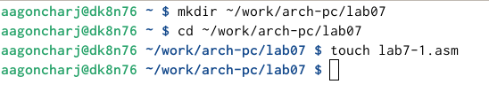{ #fig:001 width=70% }

Ввожу в файл lab7-1.asm текст программы из листинга 7.1 (рис. [-@fig:002]).

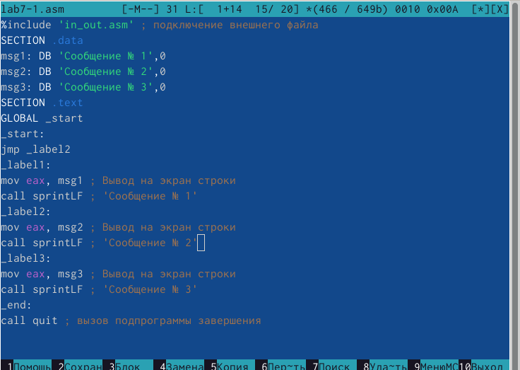{ #fig:002 width=70% }

Создаю исполняемый файл и запускаю его (рис. [-@fig:003]).

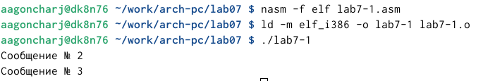{ #fig:003 width=70% }

Изменяю текст программы в файле lab7-1.asm в соответствии с листингом 7.2 (рис. [-@fig:004])

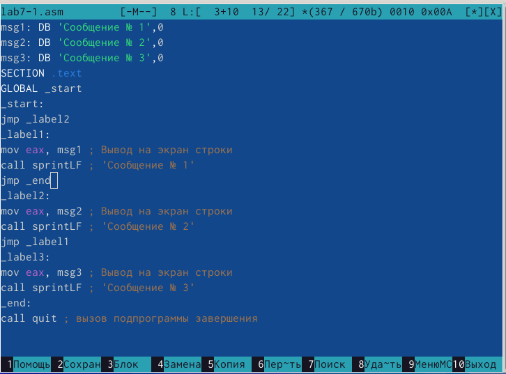{ #fig:004 width=70% }

Создаю исполняемый файл и запускаю его (рис. [-@fig:005]).

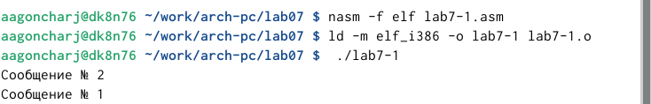{ #fig:005 width=70% }

Теперь изменяю текст программы в этом же файле, чтобы программа выводила сначала "Сообщение №3",затем "Сообщение №2" и "Сообщение №1" (рис. [-@fig:006])

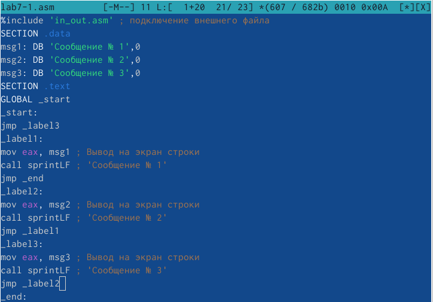{ #fig:006 width=70% }

Создаю исполняемый файл и запускаю его (рис. [-@fig:007]).

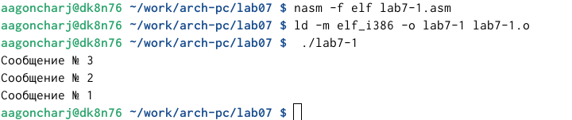{ #fig:007 width=70% }

Создаю файл lab7-2.asm (рис. [-@fig:008]).

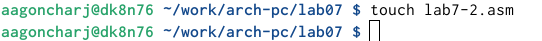{ #fig:008 width=70% }

Ввожу в этот файл текст программы из листинга 7.3 (рис. [-@fig:009]).

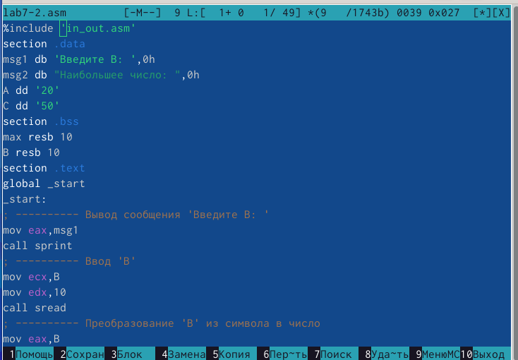{ #fig:09 width=70% }

Создаю исполняемый файл и запускаю его (рис. [-@fig:010]).

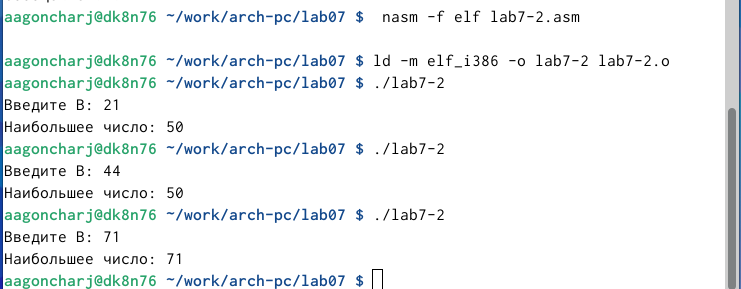{ #fig:010 width=70% }

## Изучение структуры файлы листинга

Создаю файл листинга для программы из файла lab7-2.asm с помощью ключа -l (рис. [-@fig:011]).

{ #fig:011 width=70% }

Далее открываю файл lab7-2.lst для ознокомления с его форматом и содержимым (рис. [-@fig:012]).

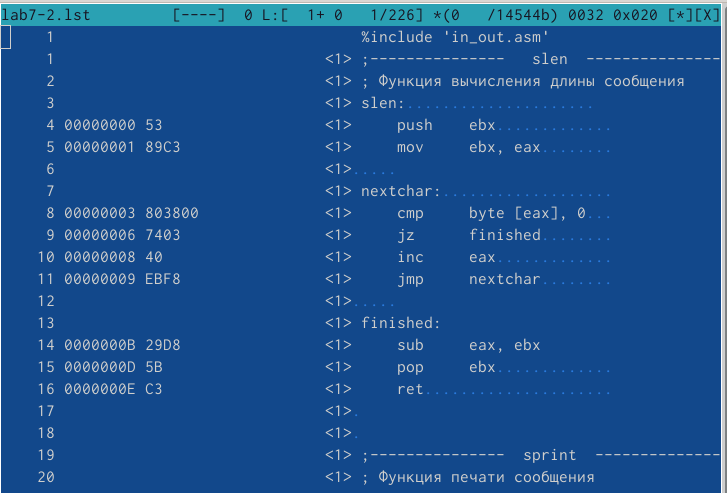{ #fig:012 width=70% }

Теперь в строке mov eax,max я убраю max в файле lab7-2.asm (рис. [-@fig:013]).

{ #fig:013 width=70% }

Пробую запустить файл, но программы выдает ошибку, так как для программы нужно два операнда (рис. [-@fig:014]).

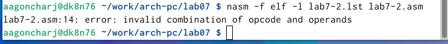{ #fig:014 width=70% }

В файле листинга тоже отображается ошибка (рис. [-@fig:015]).

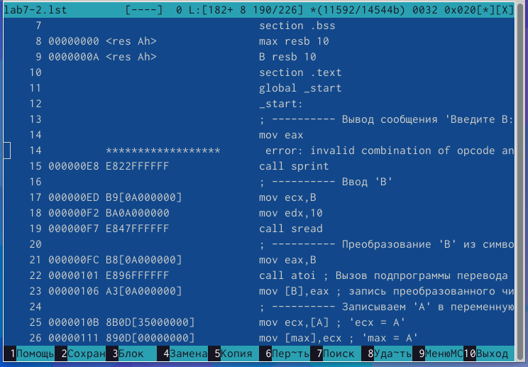{ #fig:015 width=70% }

## Задание для самостоятельной работы

1.Сначала я создаю файл lab7-3.asm (рис. [-@fig:016]).

{ #fig:016 width=70% }

Так как я меня 15 вариант, я написала программу для нахождения наименьшего из трех чисел для 32, 6, 54 (рис. [-@fig:017]).

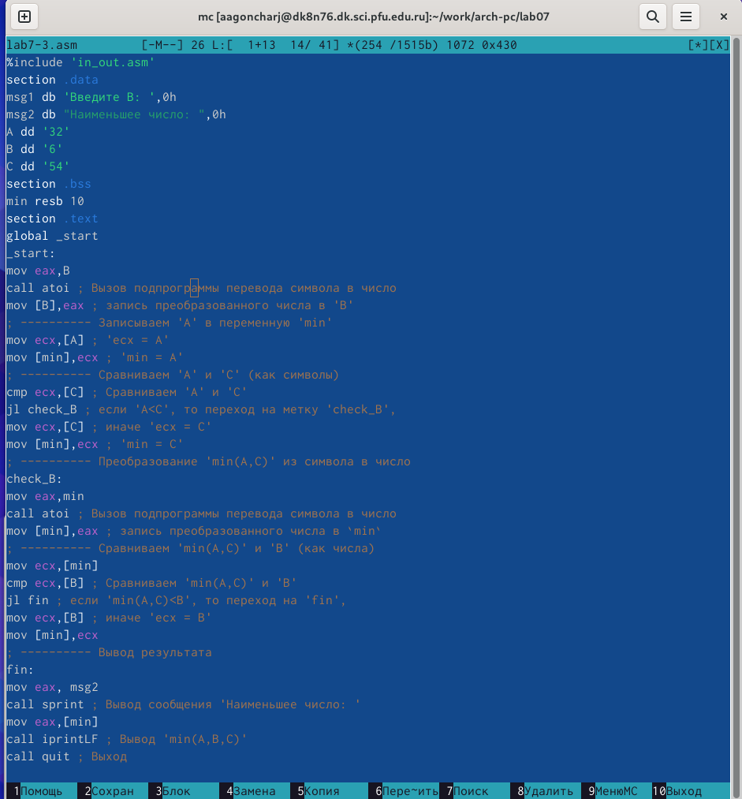{ #fig:017 width=70% }

Теперь создаю исполняемый файл и запускаю его. Программа вывела меньшее из этих чисел (рис. [-@fig:018]).

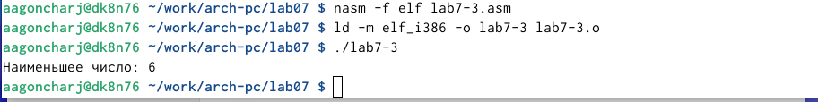{ #fig:018 width=70% }

2.Сначала я создаю файл lab7-4.asm (рис. [-@fig:019]).

{ #fig:019 width=70% }

Теперь мне необходимо написать программу, для вычисления значения функции при введенных Х и А (рис. [-@fig:020]).

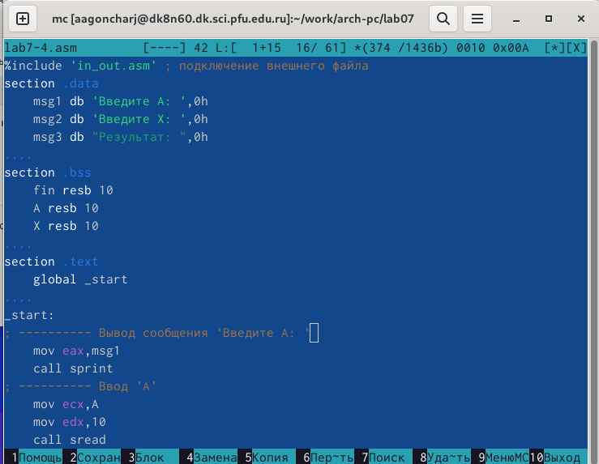{ #fig:020 width=70% }

Теперь создаю исполняемый файл и запускаю его. Программа работает верно (рис. [-@fig:021]).

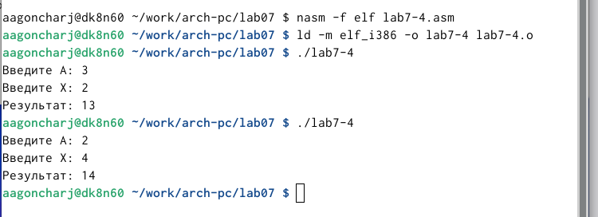{ #fig:021 width=70% }

## Листинг№1 для нахождения наименьшего из 3 чисел

```NASM
%include 'in_out.asm'
section .data
msg1 db 'Введите B: ',0h
msg2 db "Наименьшее число: ",0h
A dd '32'
B dd '6'
C dd '54'
section .bss
min resb 10
section .text
global _start
_start:
mov eax,B
call atoi ; Вызов подпрограммы перевода символа в число
mov [B],eax ; запись преобразованного числа в 'B'
; ---------- Записываем 'A' в переменную 'min'
mov ecx,[A] ; 'ecx = A'
mov [min],ecx ; 'min = A'
; ---------- Сравниваем 'A' и 'С' (как символы)
cmp ecx,[C] ; Сравниваем 'A' и 'С'
jl check_B ; если 'A<C', то переход на метку 'check_B',
mov ecx,[C] ; иначе 'ecx = C'
mov [min],ecx ; 'min = C'
; ---------- Преобразование 'min(A,C)' из символа в число
check_B:
mov eax,min
call atoi ; Вызов подпрограммы перевода символа в число
mov [min],eax ; запись преобразованного числа в `min`
; ---------- Сравниваем 'min(A,C)' и 'B' (как числа)
mov ecx,[min]
cmp ecx,[B] ; Сравниваем 'min(A,C)' и 'B'
jl fin ; если 'min(A,C)<B', то переход на 'fin',
mov ecx,[B] ; иначе 'ecx = B'
mov [min],ecx
; ---------- Вывод результата
fin:
mov eax, msg2
call sprint ; Вывод сообщения 'Наименьшее число: '
mov eax,[min]
call iprintLF ; Вывод 'min(A,B,C)'
call quit ; Выход

```

## Листинг№2 для вычисления значения функции

```NASM
%include 'in_out.asm' ; подключение внешнего файла
section .data
    msg1 db 'Введите A: ',0h
    msg2 db 'Введите X: ',0h
    msg3 db "Результат: ",0h
    
section .bss
    fin resb 10
    A resb 10
    X resb 10
    
section .text
    global _start
    
_start:
; ---------- Вывод сообщения 'Введите A: '
    mov eax,msg1
    call sprint
; ---------- Ввод 'A'
    mov ecx,A
    mov edx,10
    call sread
; ---------- Преобразование 'A' из символа в число
    mov eax,A
    call atoi ; Вызов подпрограммы перевода символа в число
    mov [A],eax

; ---------- Вывод сообщения 'Введите X: '
    mov eax,msg2
    call sprint
; ---------- Ввод 'X'
    mov ecx,X
    mov edx,10
    call sread
; ---------- Преобразование 'X' из символа в число
    mov eax,X
    call atoi ; Вызов подпрограммы перевода символа в число
    mov [X],eax


    mov ecx,[X]
    mov ebx,[A]
    cmp ecx,ebx
    jge func2
    mov edx,[A]
    add edx,10
    mov [fin],edx
    jmp final
    
func2:
    mov ax,[X]
    add ax,10
    mov [fin],ax
    jmp final

final:
    mov eax,msg3
    call sprint ; Вывод сообщения 'Результат: '
    mov eax,[fin]
    call iprintLF ; Вывод fin
    call quit ; Выход

```

# Выводы

При выполнении данной лабораторной работы я изучила команды условного и безусловного переходов, приобрела навыки написания программ с использованием переходов и ознакомилась с назначением и структурой файла листинга.

# Список литературы{.unnumbered}

::: {#refs}
:::
