---
## Front matter
title: "Отчет по лабораторной работе №8"
subtitle: "Дисциплина: архитектура компьютера"
author: "Гончарь Анастасия Александровна"

## Generic otions
lang: ru-RU
toc-title: "Содержание"

## Bibliography
bibliography: bib/cite.bib
csl: pandoc/csl/gost-r-7-0-5-2008-numeric.csl

## Pdf output format
toc: true # Table of contents
toc-depth: 2
lof: true # List of figures
lot: true # List of tables
fontsize: 12pt
linestretch: 1.5
papersize: a4
documentclass: scrreprt
## I18n polyglossia
polyglossia-lang:
  name: russian
  options:
	- spelling=modern
	- babelshorthands=true
polyglossia-otherlangs:
  name: english
## I18n babel
babel-lang: russian
babel-otherlangs: english
## Fonts
mainfont: IBM Plex Serif
romanfont: IBM Plex Serif
sansfont: IBM Plex Sans
monofont: IBM Plex Mono
mathfont: STIX Two Math
mainfontoptions: Ligatures=Common,Ligatures=TeX,Scale=0.94
romanfontoptions: Ligatures=Common,Ligatures=TeX,Scale=0.94
sansfontoptions: Ligatures=Common,Ligatures=TeX,Scale=MatchLowercase,Scale=0.94
monofontoptions: Scale=MatchLowercase,Scale=0.94,FakeStretch=0.9
mathfontoptions:
## Biblatex
biblatex: true
biblio-style: "gost-numeric"
biblatexoptions:
  - parentracker=true
  - backend=biber
  - hyperref=auto
  - language=auto
  - autolang=other*
  - citestyle=gost-numeric
## Pandoc-crossref LaTeX customization
figureTitle: "Рис."
tableTitle: "Таблица"
listingTitle: "Листинг"
lofTitle: "Список иллюстраций"
lotTitle: "Список таблиц"
lolTitle: "Листинги"
## Misc options
indent: true
header-includes:
  - \usepackage{indentfirst}
  - \usepackage{float} # keep figures where there are in the text
  - \floatplacement{figure}{H} # keep figures where there are in the text
---

# Цель работы

Целью данной лабораторной работы является приобретение навыков написания программ с использованием циклов и обработкой аргументов командной строки.

# Задание

1.Реализация циклов в NASM
2.Обработка аргументов командной строки
3.Задание для самостоятельной работы

# Теоретическое введение

Здесь описываются теоретические аспекты, связанные с выполнением работы.

Например, в табл. [-@tbl:std-dir] приведено краткое описание стандартных каталогов Unix.

: Описание некоторых каталогов файловой системы GNU Linux {#tbl:std-dir}

| Имя каталога | Описание каталога                                                                                                          |
|--------------|----------------------------------------------------------------------------------------------------------------------------|
| `/`          | Корневая директория, содержащая всю файловую                                                                               |
| `/bin `      | Основные системные утилиты, необходимые как в однопользовательском режиме, так и при обычной работе всем пользователям     |
| `/etc`       | Общесистемные конфигурационные файлы и файлы конфигурации установленных программ                                           |
| `/home`      | Содержит домашние директории пользователей, которые, в свою очередь, содержат персональные настройки и данные пользователя |
| `/media`     | Точки монтирования для сменных носителей                                                                                   |
| `/root`      | Домашняя директория пользователя  `root`                                                                                   |
| `/tmp`       | Временные файлы                                                                                                            |
| `/usr`       | Вторичная иерархия для данных пользователя                                                                                 |

Более подробно про Unix см. в [@tanenbaum_book_modern-os_ru; @robbins_book_bash_en; @zarrelli_book_mastering-bash_en; @newham_book_learning-bash_en].

# Выполнение лабораторной работы

## Реализация циклов в NASM

Создаю каталог для лабораторной работы № 8, перехожу в него и создаю
файл lab8-1.asm (рис. [-@fig:001]).

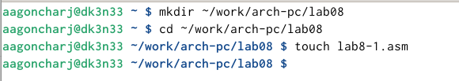{ #fig:001 width=70% }

Открываю созданный файл и ввожу в него текст программы из листинга 8.1 (рис. [-@fig:002]).

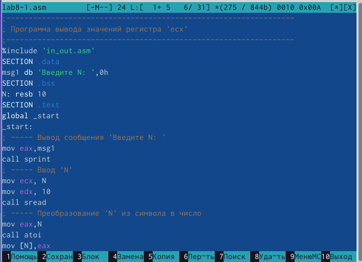{ #fig:002 width=70% }

Создаю исполняемый файл и запускаю его (рис. [-@fig:003]).

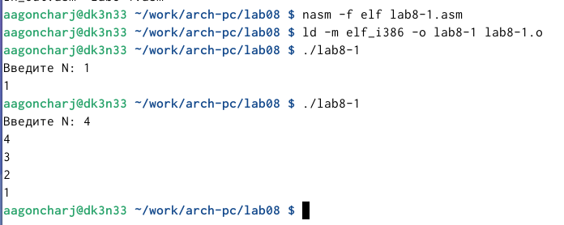{ #fig:003 width=70% }

Изменяю текст программы, в теле цикла label добавляю строку sub eax,1 (рис. [-@fig:004]).

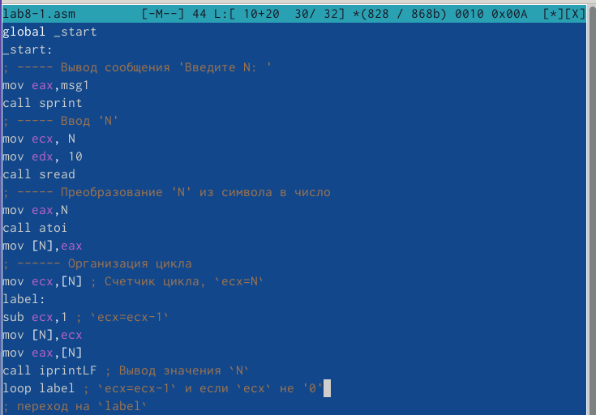{ #fig:004 width=70% }

Создаю исполняемый файл и запускаю его (рис. [-@fig:005]).

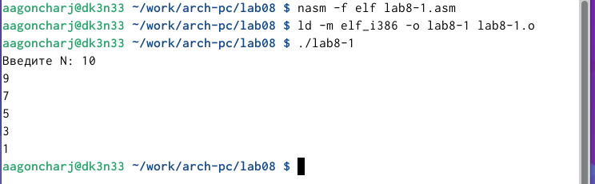{ #fig:005 width=70% }

Теперь вношу изменения в текст программы добавив команды push и pop (добавления в стек и извлечения из стека) для сохранения значения счетчика цикла loop (рис. [-@fig:006]).

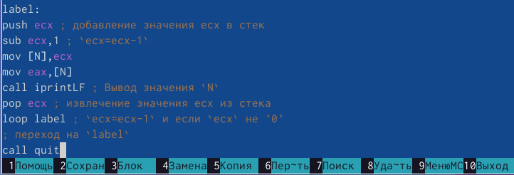{ #fig:006 width=70% }

Создаю исполняемый файл и запускаю его (рис. [-@fig:007]).

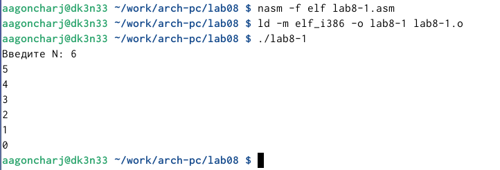{ #fig:007 width=70% }

## Обработка аргументов командной строки

Создаю файл lab8-2.asm (рис. [-@fig:008]).

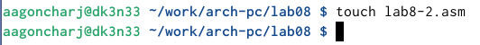{ #fig:008 width=70% }

Открываю файл и ввожу в него текст из листинга 8.2 (рис. [-@fig:009]).

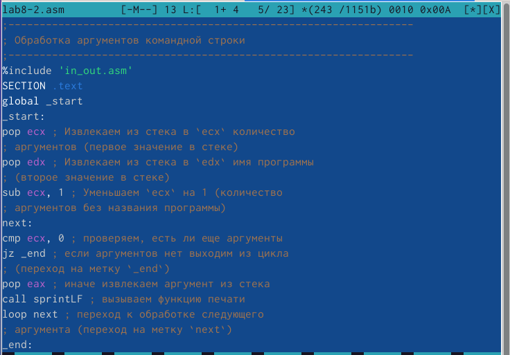{ #fig:009 width=70% }

Создаю исполняемый файл и запускаю его (рис. [-@fig:010]).

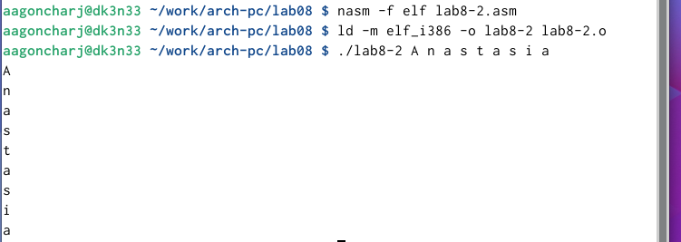{ #fig:010 width=70% }

Далее создаю файл lab8-3.asm (рис. [-@fig:011]).

{ #fig:011 width=70% }

Открываю файл и ввожу в него текст из листинга 8.3 (рис. [-@fig:012]).

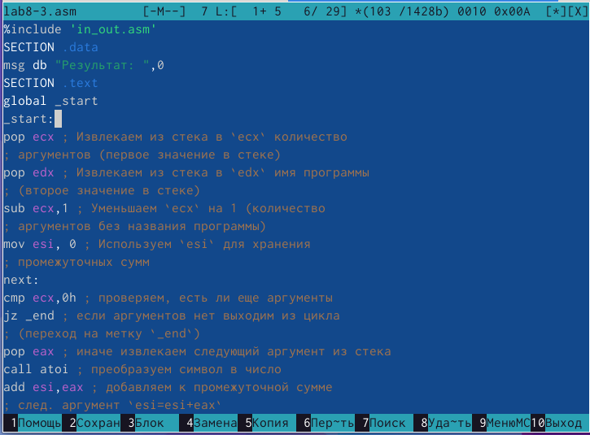{ #fig:012 width=70% }

Создаю исполняемый файл и запускаю его (рис. [-@fig:013]).

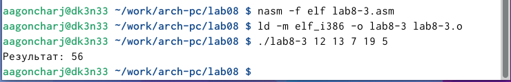{ #fig:013 width=70% }

Изменяю программу так, чтобы она выводила произведение введенных чисел (рис. [-@fig:014]).

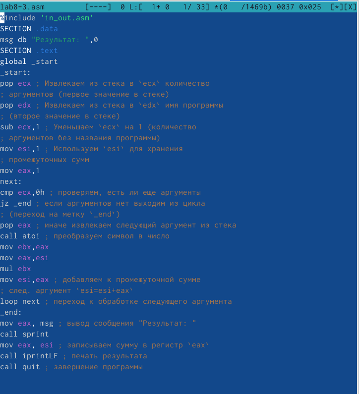{ #fig:014 width=70% }

Создаю исполняемый файл и запускаю его (рис. [-@fig:015]).

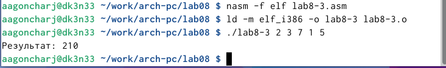{ #fig:015 width=70% }

## Задание для самостоятельной работы

Создаю файл lab8-4.asm (рис. [-@fig:016]).

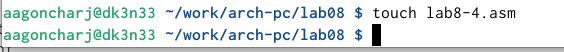{ #fig:016 width=70% }

У меня 15 вариант, поэтому пишу прорамму для f(x)=6x+13 в созданном файле (рис. [-@fig:017]).

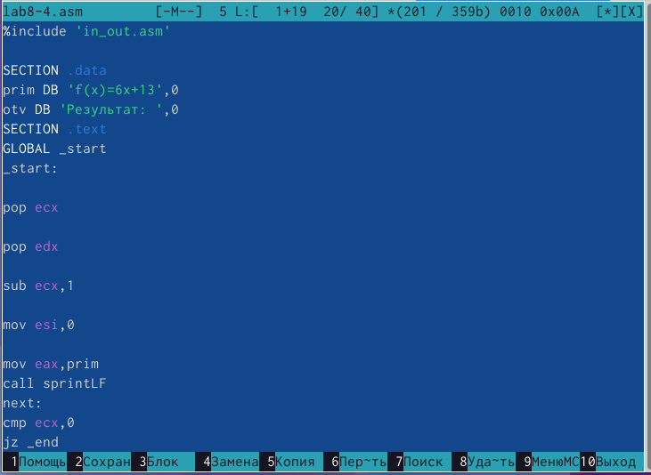{ #fig:017 width=70% }

Создаю исполняемый файл и запускаю его (рис. [-@fig:018]). Программа работает верно.

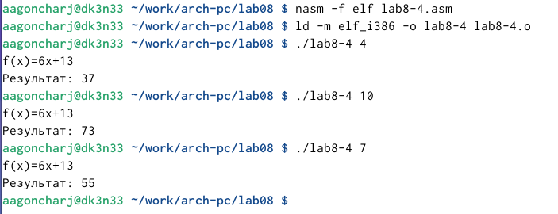{ #fig:018 width=70% }

### Листинг для файла lab8-4.asm

```NASM
%include 'in_out.asm'

SECTION .data
prim DB 'f(x)=6x+13',0
otv DB 'Результат: ',0
SECTION .text
GLOBAL _start
_start:

pop ecx

pop edx

sub ecx,1

mov esi,0

mov eax,prim
call sprintLF
next:
cmp ecx,0
jz _end

mov ebx,6
pop eax
call atoi
mul ebx

add eax,13

add esi,eax

loop next

_end:
mov eax,otv
call sprint
mov eax,esi
call iprintLF
call quit

```

# Выводы

При выполнении данной лабораторной работы я приобрела навыки написания программ с использованием циклов и обработкой аргументов командной строки.

# Список литературы{.unnumbered}

::: {#refs}
:::
