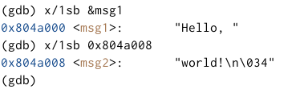

---
## Front matter
title: "Отчет по лабораторной работе №9"
subtitle: "Дисциплина: архитектура компьютера"
author: "Гончарь Анастасия Александровна"

## Generic otions
lang: ru-RU
toc-title: "Содержание"

## Bibliography
bibliography: bib/cite.bib
csl: pandoc/csl/gost-r-7-0-5-2008-numeric.csl

## Pdf output format
toc: true # Table of contents
toc-depth: 2
lof: true # List of figures
lot: true # List of tables
fontsize: 12pt
linestretch: 1.5
papersize: a4
documentclass: scrreprt
## I18n polyglossia
polyglossia-lang:
  name: russian
  options:
	- spelling=modern
	- babelshorthands=true
polyglossia-otherlangs:
  name: english
## I18n babel
babel-lang: russian
babel-otherlangs: english
## Fonts
mainfont: IBM Plex Serif
romanfont: IBM Plex Serif
sansfont: IBM Plex Sans
monofont: IBM Plex Mono
mathfont: STIX Two Math
mainfontoptions: Ligatures=Common,Ligatures=TeX,Scale=0.94
romanfontoptions: Ligatures=Common,Ligatures=TeX,Scale=0.94
sansfontoptions: Ligatures=Common,Ligatures=TeX,Scale=MatchLowercase,Scale=0.94
monofontoptions: Scale=MatchLowercase,Scale=0.94,FakeStretch=0.9
mathfontoptions:
## Biblatex
biblatex: true
biblio-style: "gost-numeric"
biblatexoptions:
  - parentracker=true
  - backend=biber
  - hyperref=auto
  - language=auto
  - autolang=other*
  - citestyle=gost-numeric
## Pandoc-crossref LaTeX customization
figureTitle: "Рис."
tableTitle: "Таблица"
listingTitle: "Листинг"
lofTitle: "Список иллюстраций"
lotTitle: "Список таблиц"
lolTitle: "Листинги"
## Misc options
indent: true
header-includes:
  - \usepackage{indentfirst}
  - \usepackage{float} # keep figures where there are in the text
  - \floatplacement{figure}{H} # keep figures where there are in the text
---

# Цель работы

Целью работы является приобретение навыков написания программ с использованием подпрограмм, а также знакомство с методами отладки при помощи GDB и его основными возможностями.

# Задание

1.Реализация подпрограмм в NASM
2.Отладка программам с помощью GDB
3.Добавление точек останова
4.Работа с данными программы в GDB
5.Обработка аргументов командной строки в GDB
6.Задание для самостоятельной работы

# Теоретическое введение

Здесь описываются теоретические аспекты, связанные с выполнением работы.

Например, в табл. [-@tbl:std-dir] приведено краткое описание стандартных каталогов Unix.

: Описание некоторых каталогов файловой системы GNU Linux {#tbl:std-dir}

| Имя каталога | Описание каталога                                                                                                          |
|--------------|----------------------------------------------------------------------------------------------------------------------------|
| `/`          | Корневая директория, содержащая всю файловую                                                                               |
| `/bin `      | Основные системные утилиты, необходимые как в однопользовательском режиме, так и при обычной работе всем пользователям     |
| `/etc`       | Общесистемные конфигурационные файлы и файлы конфигурации установленных программ                                           |
| `/home`      | Содержит домашние директории пользователей, которые, в свою очередь, содержат персональные настройки и данные пользователя |
| `/media`     | Точки монтирования для сменных носителей                                                                                   |
| `/root`      | Домашняя директория пользователя  `root`                                                                                   |
| `/tmp`       | Временные файлы                                                                                                            |
| `/usr`       | Вторичная иерархия для данных пользователя                                                                                 |

Более подробно про Unix см. в [@tanenbaum_book_modern-os_ru; @robbins_book_bash_en; @zarrelli_book_mastering-bash_en; @newham_book_learning-bash_en].

# Выполнение лабораторной работы

## Реализация подпрограмм в NASM

Сначала я создаю каталог lab09 и файл lab9-1.asm (рис. [-@fig:001]).

{ #fig:001 width=70% }

Открываю созданный файл и ввожу в него тест программы из листинга 9.1 (рис. [-@fig:002]).

{ #fig:002 width=70% }

Создаю исполняемый файл и запусаю его (рис. [-@fig:003]).

{ #fig:003 width=70% }

Изменяю текст программы так, чтобы она вычисляла значение выражения f(g(x))(рис. [-@fig:004]).

{ #fig:004 width=70% }

Создаю исполняемый файл и запусаю его (рис. [-@fig:005]).

{ #fig:005 width=70% }

## Отладка программам с помощью GDB

Создаю файл lab9-2.asm (рис. [-@fig:006]).

{ #fig:006 width=70% }

Ввожу в него тескт программы из листинга 9.2 (рис. [-@fig:007]).

{ #fig:007 width=70% }

Далее получаю исполнямый файл с помощью ключа -g и загружаю этот файл в отладчик gdb (рис. [-@fig:008]).

{ #fig:008 width=70% }

Проверяю работу программы, запустив ее в оболочке GDB с помощью команды run (сокращённо r) (рис. [-@fig:009]).

{ #fig:009 width=70% }

Теперь устанавливаю брейкпоинт на метку _start и запускаю программу (рис. [-@fig:010]).

{ #fig:010 width=70% }

Посмотриваю дисассимилированный код программы с помощью команды disassemble, начиная с метки _start (рис. [-@fig:011]).

{ #fig:011 width=70% }

Переключаюсь на отображение команд с Intel’овским синтаксисом, введя команду set disassembly-flavor intel (рис. [-@fig:012]).

{ #fig:012 width=70% }

Для удобства включаю режим псевдографики (рис. [-@fig:013]).

{ #fig:013 width=70% }

## Добавление точек останова

На предыдущих шагах была установлена точка остановки по имени метки (_start),проверяю это с помощью команды info breakpoints (кратко i b). Также устанавливаю еще одну точку остановки по адресу инструкции и снова смотрю информацию о всех установленных метках(рис. [-@fig:014]).

{ #fig:014 width=70% }

## Работа с данными программы в GDB

С помощью команды si я посмотрела регистры и изменила их (рис. [-@fig:015]).

{ #fig:015 width=70% }

Далее я посмотрела значения переменных msg1 и msg2 (рис. [-@fig:016]).

{ #fig:016 width=70% }

С помощью команды set я изменяю значения переменных msg1 и msg2 (рис. [-@fig:017]).

{ #fig:017 width=70% }

Теперь вывожу значение регистров ecx и eax с помощью (рис. [-@fig:018]).

{ #fig:018 width=70% }

Теперь изменяю значение регистра ebx (рис. [-@fig:019]). Команда выводит два разных значения, так как в первый раз мы вносим значение 2, а во второй раз регистр равен двум.

{ #fig:019 width=70% }

Завершаю выполнение программы с помощью команды continue (сокращенно c) и выхожу из GDB с помощью команды quit (сокращенно q).

## Обработка аргументов командной строки в GDB

Копирую файл lab8-2.asm и переименовываю его (рис. [-@fig:020]).

{ #fig:020 width=70% }

Создаю исполняемый файл (рис. [-@fig:021]).

{ #fig:021 width=70% }

Запускаю файл, указав аргументы (рис. [-@fig:022]).

{ #fig:022 width=70% }

Ставлю метку на _start и запустил файл (рис. [-@fig:023]).

{ #fig:023 width=70% }

Проверяю адрес вершины стека, там хранится 5 элементов (рис. [-@fig:024]).

{ #fig:024 width=70% }

Теперь просматриваю все позиции стека. По первому адресу хранится адрес, а в остальных адресах хранятся элементы. при этом элементы расположены с интервалом в 4 единицы, так как стек может хранить до 4 байт, и для того чтобы данные сохранялись нормально и без помех, компьютер использует новый стек для новой информации (рис. [-@fig:025]).

{ #fig:025 width=70% }

## Задание для самостоятельной работы

1) Копирую файл lab8-4.asm из лаборатоной работы №8 в папку для лаборатоной №9 с названием lab9-4.asm и изменяю текст программы так, чтобы она вычисляла значение функции как подпрограмму (рис. [-@fig:026]).

{ #fig:026 width=70% }

Создаю исполняемый файл и запускаю его (рис. [-@fig:027]).

{ #fig:027 width=70% }

### Листинг для файла lab9-4.asm

```NASM
%include 'in_out.asm'

SECTION .data
prim DB 'f(x)=6x+13',0
otv DB 'Результат: ',0
SECTION .text
GLOBAL _start
_start:

pop ecx

pop edx

sub ecx,1

mov esi,0

mov eax,prim
call sprintLF
next:
cmp ecx,0
jz _end

pop eax
call atoi
call fir
add esi,eax
mul ebx

loop next

_end:
mov eax,otv
call sprint
mov eax,esi
call iprintLF
call quit

fir:
mov ebx,6
mul ebx
add eax,13
ret

```

2) Создаю файл lab9-5.asm (рис. [-@fig:028]).

{ #fig:028 width=70% }

Открываю созданный файл и ввожу в него текст программы из листинга 9.3 (рис. [-@fig:029]).

{ #fig:029 width=70% }

Создаю исполняемый файл и запускаю его (рис. [-@fig:030]). Ошибка арифметическая, так как вместо 25,программа выводит 10.

{ #fig:030 width=70% }

После появления ошибки, я запускаю программу в отладчике (рис. [-@fig:031]).

{ #fig:031 width=70% }

Я открыла регистры, поняла что регистры стоят не на своих местах и исправила это (рис. [-@fig:032]).

{ #fig:032 width=70% }

Я изменила регистры(рис. [-@fig:033]) и запустила программу(рис. [-@fig:034]). Программа вывела 25, то есть все работает правильно.

{ #fig:033 width=70% }

{ #fig:034 width=70% }

### Листинг для файла lab9-5.asm

```NASM
%include 'in_out.asm'
SECTION .data
div: DB 'Результат: ',0
SECTION .text
GLOBAL _start
_start:
; ---- Вычисление выражения (3+2)*4+5
mov ebx,3
mov eax,2
add eax,ebx
mov ecx,4
mul ecx
add eax,5
mov edi,eax
; ---- Вывод результата на экран
mov eax,div
call sprint
mov eax,edi
call iprintLF
call quit

```

# Выводы

При выполнении данной лабораторной работы я приобрела навыки написания программ с использованием подпрограмм, а также ознакомилась с методами отладки при помощи GDB и его основными возможностями.

# Список литературы{.unnumbered}

::: {#refs}
:::
