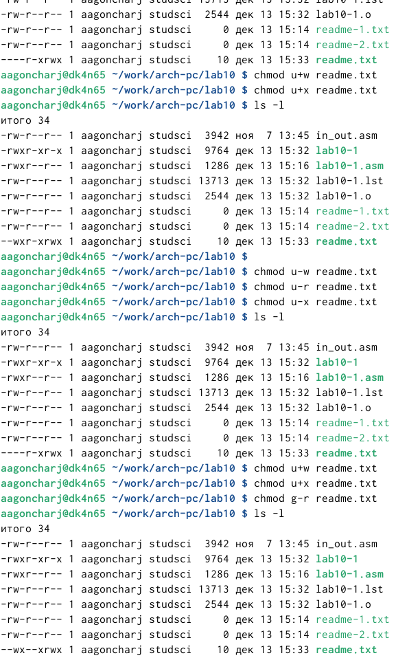
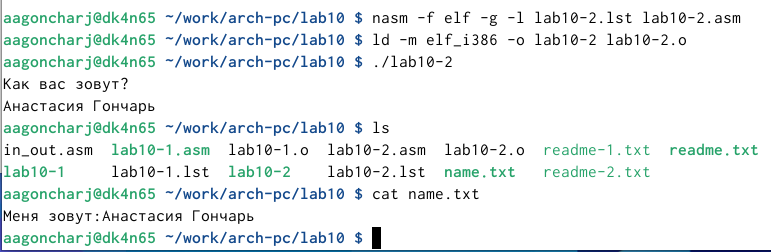

---
## Front matter
title: "Отчет по лабораторной работе №10"
subtitle: "Дисциплина: архитектура компьютера"
author: "Гончарь Анастасия Александровна"

## Generic otions
lang: ru-RU
toc-title: "Содержание"

## Bibliography
bibliography: bib/cite.bib
csl: pandoc/csl/gost-r-7-0-5-2008-numeric.csl

## Pdf output format
toc: true # Table of contents
toc-depth: 2
lof: true # List of figures
lot: true # List of tables
fontsize: 12pt
linestretch: 1.5
papersize: a4
documentclass: scrreprt
## I18n polyglossia
polyglossia-lang:
  name: russian
  options:
	- spelling=modern
	- babelshorthands=true
polyglossia-otherlangs:
  name: english
## I18n babel
babel-lang: russian
babel-otherlangs: english
## Fonts
mainfont: IBM Plex Serif
romanfont: IBM Plex Serif
sansfont: IBM Plex Sans
monofont: IBM Plex Mono
mathfont: STIX Two Math
mainfontoptions: Ligatures=Common,Ligatures=TeX,Scale=0.94
romanfontoptions: Ligatures=Common,Ligatures=TeX,Scale=0.94
sansfontoptions: Ligatures=Common,Ligatures=TeX,Scale=MatchLowercase,Scale=0.94
monofontoptions: Scale=MatchLowercase,Scale=0.94,FakeStretch=0.9
mathfontoptions:
## Biblatex
biblatex: true
biblio-style: "gost-numeric"
biblatexoptions:
  - parentracker=true
  - backend=biber
  - hyperref=auto
  - language=auto
  - autolang=other*
  - citestyle=gost-numeric
## Pandoc-crossref LaTeX customization
figureTitle: "Рис."
tableTitle: "Таблица"
listingTitle: "Листинг"
lofTitle: "Список иллюстраций"
lotTitle: "Список таблиц"
lolTitle: "Листинги"
## Misc options
indent: true
header-includes:
  - \usepackage{indentfirst}
  - \usepackage{float} # keep figures where there are in the text
  - \floatplacement{figure}{H} # keep figures where there are in the text
---

# Цель работы

Целью лабораторной работы является приобретение навыков написания программ для работы с файлами.

# Задание

1.Права доступа к файлам.
2.Задание для самостоятельной работы.

# Теоретическое введение

Здесь описываются теоретические аспекты, связанные с выполнением работы.

Например, в табл. [-@tbl:std-dir] приведено краткое описание стандартных каталогов Unix.

: Описание некоторых каталогов файловой системы GNU Linux {#tbl:std-dir}

| Имя каталога | Описание каталога                                                                                                          |
|--------------|----------------------------------------------------------------------------------------------------------------------------|
| `/`          | Корневая директория, содержащая всю файловую                                                                               |
| `/bin `      | Основные системные утилиты, необходимые как в однопользовательском режиме, так и при обычной работе всем пользователям     |
| `/etc`       | Общесистемные конфигурационные файлы и файлы конфигурации установленных программ                                           |
| `/home`      | Содержит домашние директории пользователей, которые, в свою очередь, содержат персональные настройки и данные пользователя |
| `/media`     | Точки монтирования для сменных носителей                                                                                   |
| `/root`      | Домашняя директория пользователя  `root`                                                                                   |
| `/tmp`       | Временные файлы                                                                                                            |
| `/usr`       | Вторичная иерархия для данных пользователя                                                                                 |

Более подробно про Unix см. в [@tanenbaum_book_modern-os_ru; @robbins_book_bash_en; @zarrelli_book_mastering-bash_en; @newham_book_learning-bash_en].

# Выполнение лабораторной работы

## Права доступа к файлам

Я создала каталог и файлы для лабораторной работы (рис. [-@fig:001]).

{ #fig:001 width=70% }

Ввела в файл текст программы (рис. [-@fig:002]). Далее создала исполняемый файл и запустила его (рис. [-@fig:003]). Ответ сохранился в файле readme.txt.

{ #fig:002 width=70% }

{ #fig:003 width=70% }

С помощью команды сhmod я запретила выполнять программу. При попытке выполнить программу - отказ в доступе (рис. [-@fig:004]).

{ #fig:004 width=70% }

С помощью команды я дала разрешение на исполнение файлу с исходным текстом. Создала исполняемый файл и запустила его, программы заработала (рис. [-@fig:004], рис. [-@fig:004]).

{ #fig:005 width=70% }

{ #fig:006 width=70% }

Я предоставила определенные права файлу readme.txt в соответствие с вариантом 15 (рис. [-@fig:007]).

{ #fig:007 width=70% }

## Задание для самостоятельной работы

Я создала файл lab10-2.asm и написала программу, которая запрашивает имя и выводит его в созданном файле (рис. [-@fig:008]). Файл создает сама программа.

{ #fig:008 width=70% }

Создала и запустила исполняемый файл (рис. [-@fig:009]).

{ #fig:009 width=70% }

### Листинг для файла lab10-2.asm

```NASM
%include 'in_out.asm'

SECTION .data
file db 'name.txt', 0h
msg db 'Как вас зовут? ', 0h
imia DB 'Меня зовут:',0

SECTION .bss
con resb 2550

SECTION .text
global _start
_start:

mov eax,msg
call sprintLF

mov ecx, con
mov edx, 2550
call sread

mov ecx, 0777o
mov ebx, file
mov eax, 8
int 80h

mov esi, eax

mov eax,imia
call slen

mov edx,eax
mov ecx,imia
mov ebx,esi
mov eax,4
int 80h

mov eax, con
call slen

mov edx, eax
mov ecx, con
mov ebx, esi
mov eax, 4
int 80h

mov ebx, esi
mov eax, 6
int 80h
call quit

```

# Выводы

Выполнив лабораторную работу, я приобрела навыки написания программ для работы с файлами.

# Список литературы{.unnumbered}

::: {#refs}
:::
